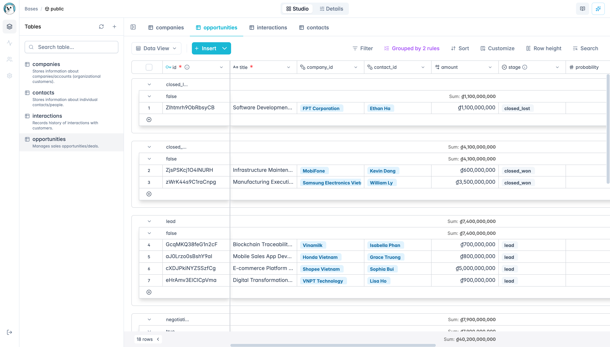
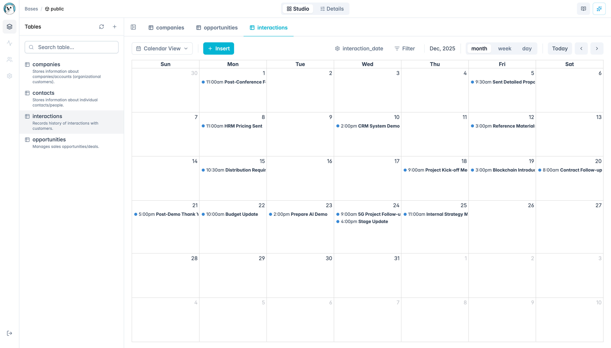
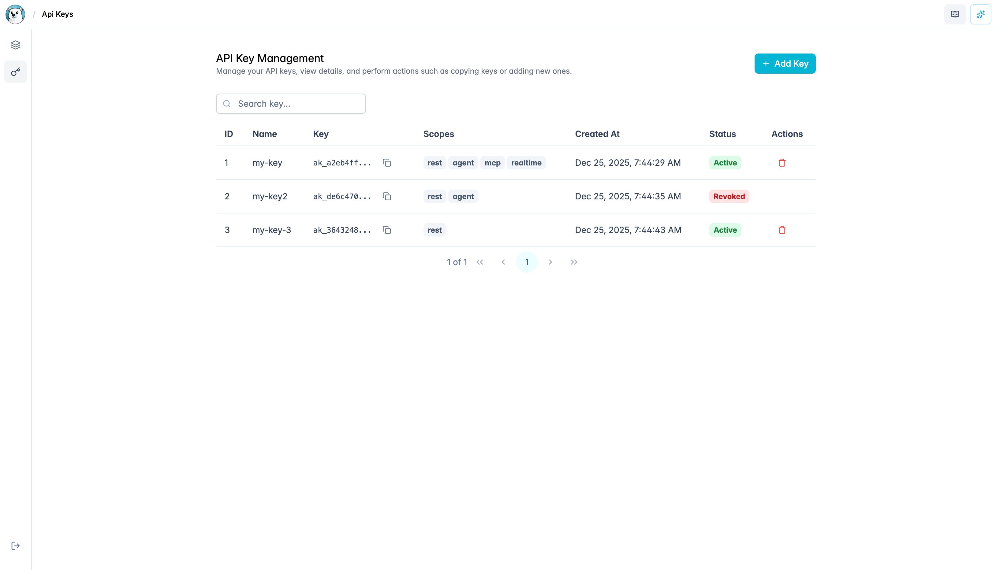

<div align="center">
   
   <br>
   <span style="font-size: 48px; font-weight: bold;">PolarBase</span>
   <br>
   <b>Open-source No-code Database platform</b> <br />
   <b>Spreadsheet-like UI • AI-powered • No SQL required • Self-hosted</b> <br />
   <br>
</div>

<div align="center">

[](https://github.com/polarbase-team/polarbase/stargazers)
[](https://github.com/polarbase-team/polarbase/blob/main/LICENSE)

</div>

<div align="center">✨ ✨ ✨</div>

## 1. Introduction

**Polarbase** is an open-source platform that directly harnesses PostgreSQL's powerful core engine for optimal performance, minimizing extra backend layers. It offers a simple, intuitive interface exclusively for PostgreSQL databases.

**Simplify your Postgres workflow with modern tools and an intuitive UI.**  
[Demo](https://demo.polarbase.example.com)

Currently in **Public Beta**—star and watch the repo for updates!

Polarbase prioritizes simplicity, performance, and data integrity: it uses SQLite only for storing metadata and layout configurations, keeping your main database clean and free from platform-specific data. This ensures no vendor lock-in—you can always use your PostgreSQL database independently.

Ideal for small to medium-sized solutions where ease of use and minimal overhead matter most.

## 2. Screenshots





## 3. Key Features

- **REST API for DB**: Secure and efficient API endpoints to interact with your PostgreSQL database.
- **AI Agent for DB**: Intelligent agent to assist with database operations (no SQL generation involved).
- **MCP Server for DB**: Model Context Protocol server for streamlined administration.
- **Realtime for DB**: Real-time updates and synchronization for dynamic data handling (via WebSocket).
- **Frontend with Spreadsheet-UI**: User-friendly spreadsheet-style interface for data visualization and manipulation.
- **API Key Management**: Generate API keys to grant controlled access to key features.

## 4. Tech Stack

- **Database**: PostgreSQL (>= 14.0)
- **Runtime**: Bun (>= 1.0)
- **Backend Framework**: Elysia (>= 1.0)
- **Frontend Framework**: Angular (>= 17.0)
- **AI Integration**: Google Gemini (default) or OpenAI
- **Languages**: TypeScript (>= 5.0), HTML, SCSS

## 5. Getting Started

### Cloud Version (Quick Try)

Visit our [hosted demo](https://demo.polarbase.example.com) to explore without installation.

### Install Bun

Bun is a fast all-in-one JavaScript runtime that significantly outperforms Node.js in startup time, HTTP throughput, and package installation—often 2-4x faster (see benchmarks: [Bun.sh](https://bun.sh), [Strapi comparison](https://strapi.io/blog/bun-vs-nodejs-performance-comparison-guide), and [Better Stack guide](https://betterstack.com/community/guides/scaling-nodejs/nodejs-vs-deno-vs-bun/)).

Install it quickly by following the official instructions: [https://bun.sh/docs/installation](https://bun.sh/docs/installation)

### Local Development

1. Clone the repository:

   ```bash
   git clone https://github.com/polarbase-team/polarbase.git
   cd polarbase
   ```

2. Install dependencies using Bun:

   ```bash
   bun install
   ```

3. Copy the example environment file:

   ```bash
   cp server/.env.example server/.env
   ```

   Then edit `server/.env` to add your configuration (API keys, database credentials, etc.).

4. Run the development servers:
   - Both server and client from root:
     ```bash
     bun start
     ```
   - Or separately:
     - Server (backend):
       ```bash
       cd server
       bun run dev
       ```
       Runs on `http://localhost:3000`
     - Client (frontend):
       ```bash
       cd client
       bun run dev
       ```
       Runs on `http://localhost:4200`

   Access the app at `http://localhost:4200` (frontend).

### Build for Production

```bash
bun run build
```

### Docker Support

Deploy easily with Docker Compose (recommended for production):

```bash
docker compose up --build
```

- Access at `http://localhost:3000`.
- Customize with environment variables in `docker-compose.yml`.

For a custom setup:

```bash
docker run -e GEMINI_API_KEY=<YOUR_GEMINI_KEY> -p 3000:3000 polarbase-team/polarbase:latest
```

## 6. Configuration

- **API Keys for AI**: Polarbase supports multiple AI providers. Use Google Gemini as the default mode by adding `GEMINI_API_KEY=your_api_key_here` to the `.env` file in the `server` folder. Alternatively, configure OpenAI with `OPENAI_API_KEY=your_api_key_here` for compatible features.
- **PostgreSQL Connection**: Set up database details (host, user, password, etc.) in `server/config.ts`.
- **Super Admin Key**: Use the super admin key for initial login and administration. Generate or set it in the `.env` file as `SUPER_ADMIN_KEY=your_secure_key_here`. This key is required to access admin features and manage API keys.
- **API Key Generation**: Once logged in as super admin, generate API keys via the MCP interface to control access to features like REST API or AI agent.

**Privacy Note**: Polarbase does not store your database credentials. All operations run locally or in your controlled environment.

## 7. Try It Out

1. Go to the [app](https://demo.polarbase.example.com).
2. Connect your PostgreSQL database.
3. Use the REST API or AI agent for operations.
4. Explore realtime features and spreadsheet-UI for data management.
5. Generate API keys to manage access.

## 8. Libraries & Technologies Used

- **Knex**: For type-safe database querying and migrations.
- **ai-sdk**: Integration for AI agents and providers (Gemini, OpenAI).
- **fast-mcp**: Efficient implementation of the Model Context Protocol server.
- **PrimeNG**: Rich set of UI components for Angular.
- **Tailwind CSS**: Utility-first CSS framework for rapid styling.
- Other dependencies: WebSocket libraries for realtime updates, Angular modules for frontend, and more (see `package.json` files in `client` and `server` for the full list).

## 9. Community & Support

- **[GitHub Issues](https://github.com/polarbase-team/polarbase/issues)**: Report bugs or request features.

## 10. Contributing

We welcome contributions! Whether it's fixing bugs, adding features, or improving docs.

- See our [Contributing Guide](./CONTRIBUTING.md) for details.
- Follow the [Code of Conduct](./CODE_OF_CONDUCT.md).

Fork the repo, create a branch, and submit a Pull Request—we'll review it ASAP.

## 11. License

Polarbase is licensed under the [MIT License](./LICENSE).

---

Made with ❤️ by the **polarbase-team**.  
If you like the project, give it a ⭐ on GitHub! 😊
